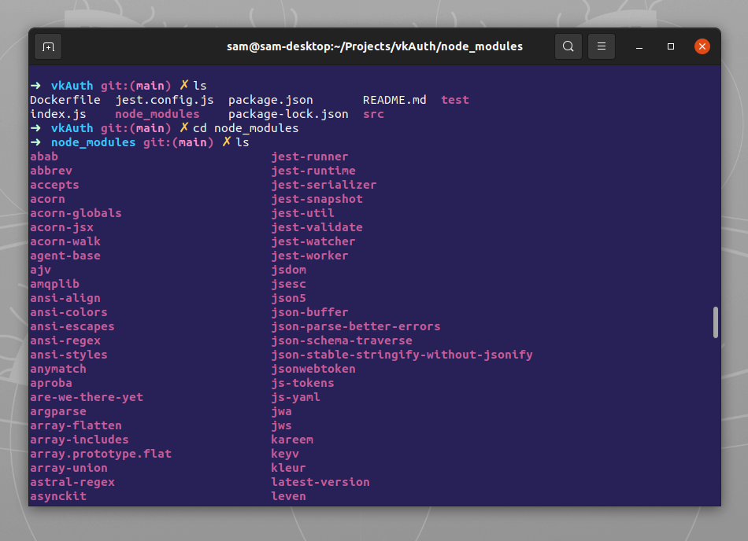

# Mjolnir for [Gnome Terminal](https://wiki.gnome.org/Apps/Terminal)

> A dark theme for [Gnome Terminal](https://wiki.gnome.org/Apps/Terminal).



## Install
```bash install.sh```

## Credits

This colorscheme is based on the well-known _Solarized Dark_ colorscheme for the Gnome Terminal.

## License

[MIT License](./LICENSE)

## Test
Tested in Gnome Shell and ZSH